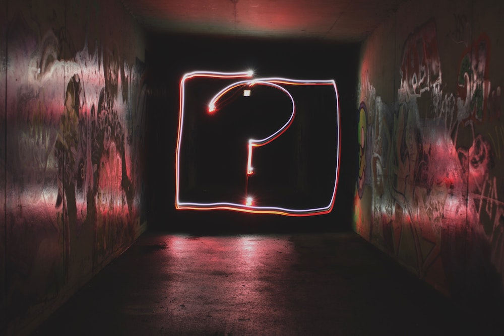
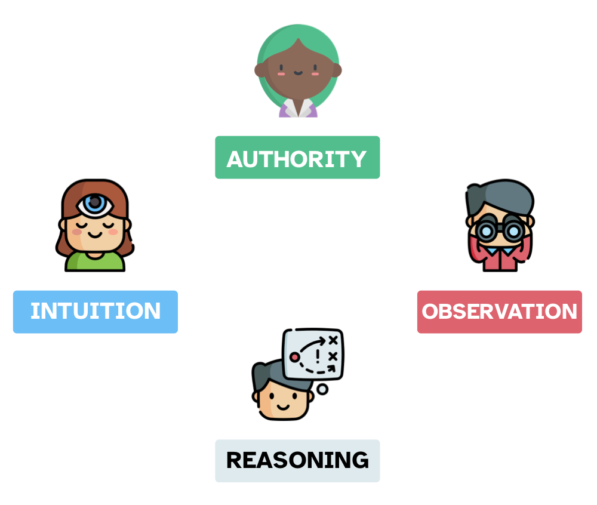
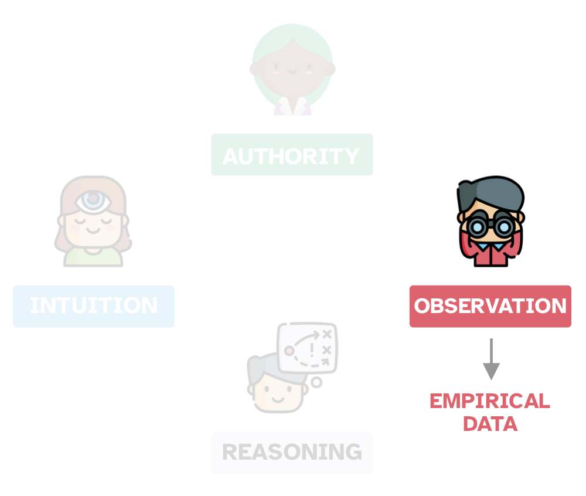
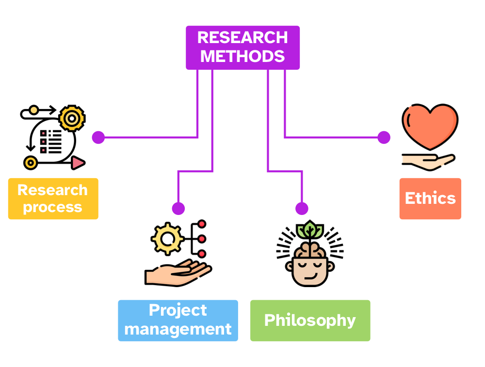
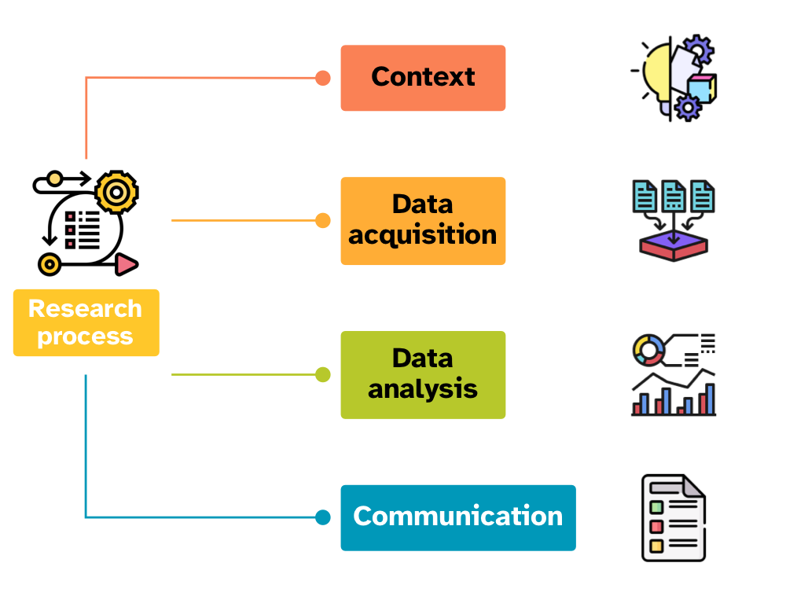
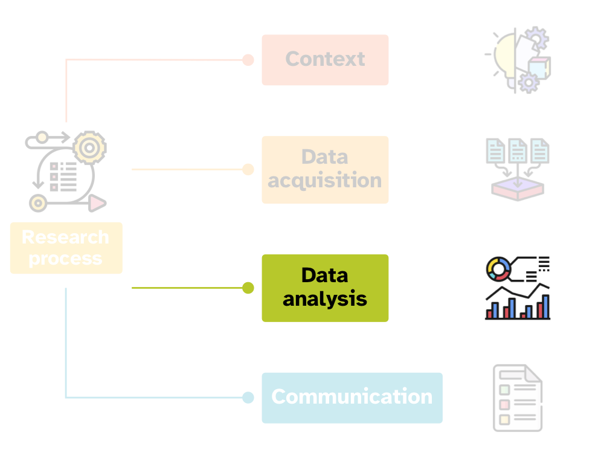
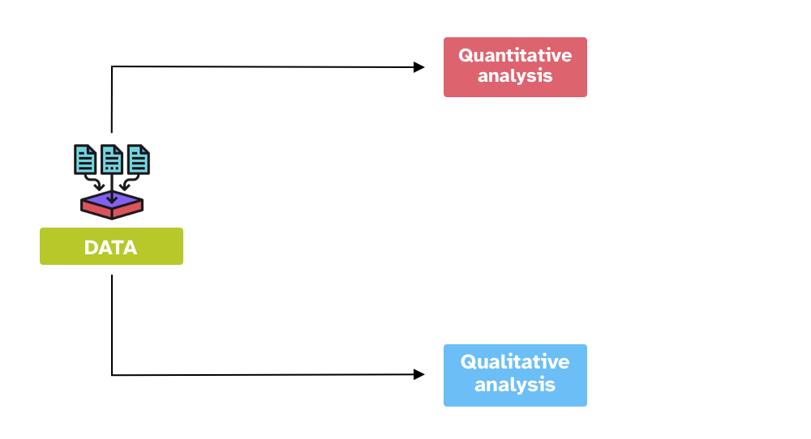
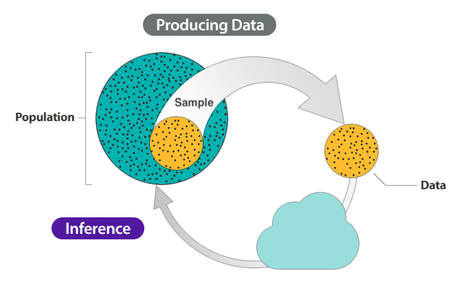
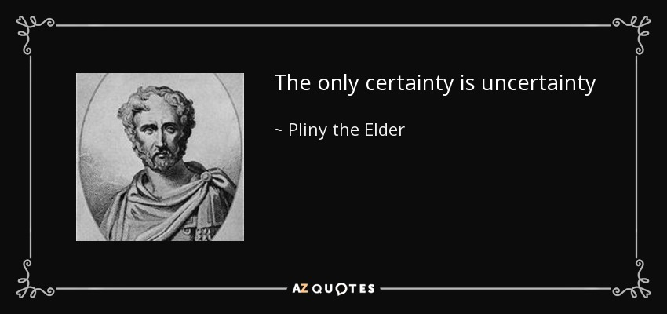
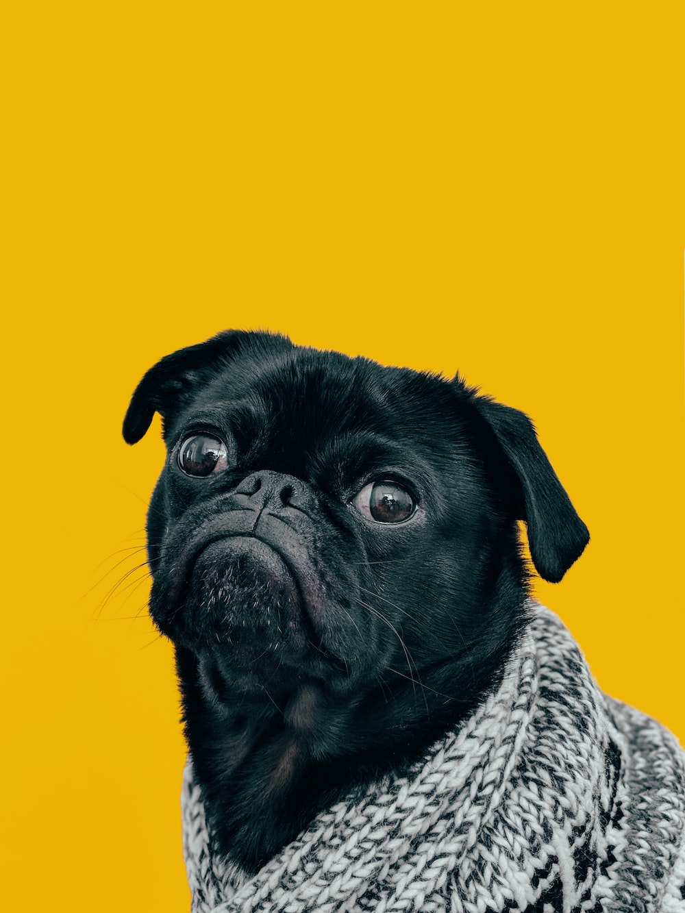

```{r setup, include=FALSE}
options(htmltools.dir.version = FALSE)
library(tidyverse)
theme_set(theme_dark())
library(xaringanExtra)
use_xaringan_extra(c("panelset", "tachyons", "freezeframe"))
```

```{r xaringan-themer, include=FALSE, warning=FALSE}
library(xaringanthemer)
style_mono_light(
  base_color = "#23395b",
  text_font_google = google_font("Lato", "400", "700", "400i", "700i"),
  header_font_google = google_font("Montserrat", "400", "700", "400i", "700i"),
  code_font_google = google_font("Source Code Pro", "400", "700")
)
```

# Before we begin...

.pull-left[
.f3[Complete the SATS-36 questionnaire.]
]

.pull-right[

]


???

Photo by Emily Morter on Unsplash

---

class: middle

.pull-left[

]

.pull-right[
.f3[For, you see, so many out-of-the-way things had happened lately, that Alice had begun to think that very few things indeed were really impossible.]

.right[—Lewis C. Carol, Alice's Adventures in Wonderland ]
]

???

"If I had a world of my own, everything would be nonsense. Nothing would be what it is, because everything would be what it isn't. And contrary wise, what is, it wouldn't be. And what it wouldn't be, it would. You see?"

.right[—Alice, from Disney's *Alice in Wonderland*]


---

background-image: url(https://saffroninteractive.com/wp-content/uploads/2014/09/Knowledge-1024x576.png)
background-size: cover

???

What is knowledge?

What does "knowledge" mean to you?

---

class: inverse
background-image: url(../../img/word-cloud.png)
background-size: cover

???

Results from Slido poll.

Where does knowledge come from?

---

layout: true

# Sources of knowledge

---

.center[

]

???

One way of classifying sources of knowledge:

- Authority

- Intuition

- Reason (logic)

- Observation.

---

.center[

]

???

Observations generate **empirical data**.

*Empirical* just means 'based on experience', where *experience* here means 'observation'.

How can we use observations/empirical data?

NOTE: Do not mix up empirical methods with experimental methods. Experiments are a kind of empirical method.

EXTRA: Check out the etymology of the word *empiric(al)* here: <https://en.wiktionary.org/wiki/empiric#English>

---

layout: false

# Research methods

.center[

]

---

layout: true

# Research process

---

.center[

]

---

.center[

]

---

layout: true

# Data analysis

---

.center[

]

---

.center[

]

---

layout: false
class: inverse right middle


.f2[The numbers have no way of speaking for themselves. We speak for them. We imbue them with meaning.]

— Nate Silver, *The Signal and the Noise*

---

# Inference process

.center[

]

???

Imbuing numbers with meaning is a good characterisation of the "inference process".

We have a question about something.

Let's imagine that this something is the population of British Sign Language signers.

We want to know whether the cultural background of the BSL signers is linked to different pragmatic uses of the sign for BROTHER.

But we can't survey the entire population of BSL signers.

NOTE: *Population* can be a set of anything, not just a specific group of people. For example, the words in a dictionary can be a "population"; or the antipassive constructions of Austronesian languages; or ...

---

# Inference process

.center[

]

???

We take a **sample** from the population.

This is our empirical data (the product of observation).

How do we go from data/observation to answering our question?

We can use **inference**.

**Inference** is the process of understanding something about a population based on the sample (aka the data) taken from that population.

---

class: middle center inverse

# Inference is not infallible

???

However, inference based on data does not guarantee that the answers to our questions are right/true.

In fact, any observation we make comes with a degree of **uncertainty and variability**.

EXTRA: Check out this article: <https://www.scientificamerican.com/article/if-you-say-science-is-right-youre-wrong/>

EXTRA: Find out about Popper's view of falsification and fallibilism.

---

# Uncertainty and variability

.center[

]

???

So we have to deal with:

- Uncertainty in any observation of a phenomenon.

- Variability among different observations of the same phenomenon.

---

class: center, middle, inverse


???

Guess what it is...

---

class: center middle inverse

# *Statistics* as a tool to deal with *uncertainty* and *variability*

???

Statistics helps us quantifying uncertainty and controlling for variability.

---

class: middle

.pull-left[
# What is statistics?
]

.pull-right[



]

???

Slido poll.

EXTRA: Check out the etymology of *statistics* here: <https://en.wiktionary.org/wiki/statistics#Etymology_1>.

Photo by <a href="https://unsplash.com/@charlesdeluvio?utm_source=unsplash&utm_medium=referral&utm_content=creditCopyText">Charles Deluvio</a> on <a href="https://unsplash.com/s/photos/dog?utm_source=unsplash&utm_medium=referral&utm_content=creditCopyText">Unsplash</a>

---

# What is statistics?

- Statistics is the **science** concerned with developing and studying methods for collecting, analyzing, interpreting and presenting empirical data. (From [UCI Department of Statistics](https://www.stat.uci.edu/what-is-statistics/))

--

- Statistics is the **technology** of extracting information, illumination and understanding from data, often in the face of uncertainty. (From the [British Academy](https://www.thebritishacademy.ac.uk/blog/what-is-statistics/))

--

- Statistics is a **mathematical and conceptual** discipline that focuses on the relation between data and hypotheses. (From the [Standford Encyclopedia of Philosophy](https://plato.stanford.edu/entries/statistics/))

--

- Statistics as the **art** of applying the science of scientific methods. (From [ORI Results](https://www.oriresults.com/articles/blog-posts/the-art-of-statistics/), [Nature](https://www.nature.com/articles/d41586-019-00898-0))

---

class: inverse right middle

.f2[*Statistic is both a science and an art*.]

.f4[It is a *science* in that its methods are basically systematic and have general application and an *art* in that their successful application depends, to a considerable degree, on the skill and special experience of the statistician, and on his knowledge of the field of application.]

—L. H. C. Tippett

---

class: middle

.pull-left[
# But...<br>*all that glisters is not gold*
]

.pull-right[

]


---

# Many Analysts, One Data Set

.pull-left[
.center[

]
]

.pull-right[
.f3[**Is there a link between player skin tone and number of red cards in soccer?**]

- **29 independent analysis teams**.

- 69% of the teams reported an effect, and 31% did not.

- **21 unique** types of statistical analysis.

<br>

> The observed results from analyzing a complex data set can be highly contingent on **justifiable**, but **subjective**, analytic decisions.

.right[—Silberzahn et al 2018]

]

---

class: bottom

background-image: url(../../img/francesco-gallarotti-ruQHpukrN7c-unsplash.jpg)
background-size: cover

# THE "NEW STATISTICS"

???

Photo by <a href="https://unsplash.com/@gallarotti?utm_source=unsplash&utm_medium=referral&utm_content=creditCopyText">Francesco Gallarotti</a> on <a href="https://unsplash.com/s/photos/new?utm_source=unsplash&utm_medium=referral&utm_content=creditCopyText">Unsplash</a>

---

# A "New Statistics"

@cumming2014

- Estimation based on effect sizes

- Confidence Intervals

- Meta-analyses
