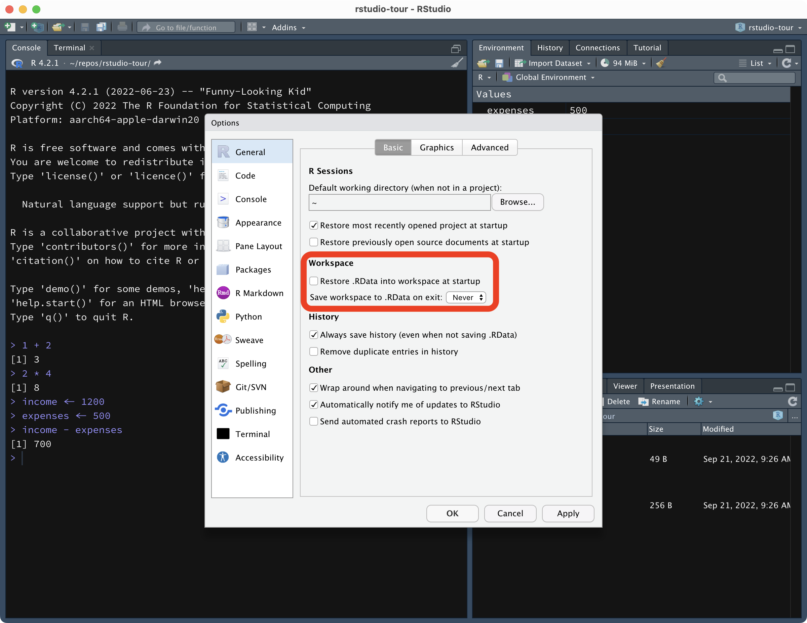

```{r setup, include=FALSE}
options(htmltools.dir.version = FALSE)
library(tidyverse)
theme_set(theme_dark())
library(xaringanExtra)
use_xaringan_extra(c("panelset", "tachyons", "freezeframe"))
```

```{r xaringan-themer, include=FALSE, warning=FALSE}
library(xaringanthemer)
style_mono_light(
  base_color = "#23395b",
  text_font_google = google_font("Lato", "400", "700", "400i", "700i"),
  header_font_google = google_font("Montserrat", "400", "700", "400i", "700i"),
  code_font_google = google_font("Source Code Pro", "400", "700")
)
```


class: middle center


---

class: middle center


---

# R vs RStudio


---

# R vs RStudio

.pull-left[
.f2[R]

- R is a **programming language**.

- We use programming languages to **interact** with computers.

- You **run commands** written in a console and the related task is executed.
]

--

.pull-right[
.f2[RStudio]

- RStudio is an Integrated Development Environment or **IDE**.

- It helps you using R more efficiently.

- It has a graphical interface.
]

---

# R vs RStudio


---

layout: true

# RStudio

---

.center[

]

---

.center[

]

---

.center[

]

---

.center[

]

---

.center[

]

---

.center[

]

---

layout: false

# R as a calculator

Write the following in the `Console`, then press `ENTER`.

```{r}
1 + 2
```

--

You did it! You run your first line of code!

---

# R as a calculator

Try some more operations...

```{r}
67 - 13
2 * 4
268 / 43
```

---

# R as a calculator

You can chain operations...

```{r}
6 + 4 - 1 + 2
4 * 2 + 3 * 2
```

---

# R as a calculator

But watch out for your brackets!

```{r}
4 * 2 + 3 * 2
(4 * 2) + (3 * 2)
4 * (2 + 3) * 2
```

---

# Forget-me-not: variables

Store a variable in the computer memory for later use.

```{r}
my_num <- 156
```

--

You can just call it back when you need it!

```{r}
my_num
```

---

# Oh my vars!

```{r}
income <- 1200
expenses <- 500
income - expenses
```

--

You can go all the way with variables!

```{r}
savings <- income - expenses
```

And check the value...

```{r}
savings
```

---

# Variables are... variable

```{r}
yo <- 5
yo + 3
yo <- 3
yo + 3
```

---

# Variables can hold more than one item

```{r}
one_i <- 6
two_i <- c(6, 8)
five_i <- c(6, 8, 42)
```

--

Note the following are the same:

```{r}
one_i <- 6
one_ii <- c(6)
```


---

# R can't function without... functions

**Functions** are operations performed on one or more *arguments*.

```{r}
sum(3, 5)
```

--

And arguments can be vectors!

```{r}
my_nums <- c(3, 5, 7)
sum(my_nums)
mean(my_nums)
```

---

# Not just numbers

Variables can store **strings**.

```{r}
name <- "Stefano"
surname <- "Coretta"
name
```

---

# Not just numbers

And strings can be used as arguments in functions.

```{r}
cat("My name is", name, surname)
```

--

And you can of course reuse the same variable name to override the variable value.

```{r}
name <- "Raj"
cat("My name is", name)
```

---

# The null and the infinite

```{r}
forgot <- NA
nothing <- NULL
everything <- Inf
```


---

# Summary


- R as a calculator

  - Arithmetic operations.

- Variable:
  
  - Numeric.
  - String.

- Function:
  
  - Function name (`sum()`, `mean()`, `cat()`).
  - Arguments.

---

# Install the course materials

Run the following in the `Console`:

``` r
install.packages("remotes")
```

<br>

--

If asked to select a mirror, select the first mirror.

- Type `1` and press `ENTER`

<br>

--

Then run the following in the `Console`.

```r
remotes::install_github("stefanocoretta/sqmf")
```

---

class: middle center inverse

.f1[TUTORIAL]
