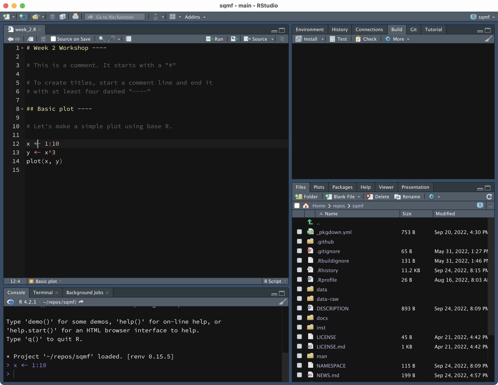

```{r setup, include=FALSE}
knitr::opts_chunk$set(echo = TRUE, warning = FALSE, message = FALSE, dpi = 300, fig.width = 7, fig.height = 5, out.height = "500px", fig.align = "center")
knitr::opts_knit$set(root.dir = here::here())
options(htmltools.dir.version = FALSE)
library(tidyverse)
theme_set(theme_light())
library(magrittr)
library(xaringanExtra)
use_xaringan_extra(c("panelset", "tachyons", "freezeframe"))
library(ggmosaic)
library(ggrepel)

library(glottologR)
data("glot_aes")

library(sqmf)
data("polite")
data("mald_1_1")
data("gestures")
gestures %<>% mutate(months = as.factor(months))
```

```{r xaringan-themer, include=FALSE, warning=FALSE}
library(xaringanthemer)
style_mono_light(
  base_color = "#23395b",
  text_font_google = google_font("Lato", "400", "700", "400i", "700i"),
  header_font_google = google_font("Montserrat", "400", "700", "400i", "700i"),
  code_font_google = google_font("Source Code Pro", "400", "700")
)
```

# Update the sqmf package

Time to update the sqmf package!

Run the following in the console:

``` r
remotes::install_github("stefanocoretta/sqmf")
```

---

# Data visualisation


---

# Graphic systems

- Base R.

- lattice.

- ggplot2.

- more...

---

# But before that... R SCRIPTS!

1. **Create a folder** inside your RStudio project named `code`.

  - You can do this from within RStudio, in the Files panel, or through the OS Finder/File explorer.

2. **Create a new R Script**.

3. Save the R script as `week_2.R` in `code/`.

---

# R script basics

- Write each command into **its own line**.

- Commands should be written in the **order they must be executed**. In other words, later lines of code depend on earlier lines of code, never the opposite.
  
- To **execute a command**, place the text cursor (or caret) anywhere in the line you want to execute and press `CMD/CTRL+ENTER`.

- You can **add comments** in a scripts by starting a line with `#`.

.center[

]

---

# Base R plotting function

```{r scatter, eval=FALSE}
x <- 1:10
y <- x^3
plot(x, y)
```

---

# Base R plotting function


```{r scatter-plot, echo=FALSE}
x <- 1:10
y <- x^3
plot(x, y)
```

---

# Base R plotting function

```{r line, eval=FALSE}
x <- seq(1, 10, by = 0.01)
y <- x^3
plot(x, y, type = "l", col = "purple", lwd = 3, lty = "dashed")
```

---

# Base R plotting function

```{r line-plot, echo=FALSE}
x <- seq(1, 10, by = 0.01)
y <- x^3
plot(x, y, type = "l", col = "purple", lwd = 3, lty = "dashed")
```

---

# Packages to the rescue

<br>

- The R **library** contains the packages you have installed.

  - Base R.

  - Extra packages.

- Install extra packages with `install.packages()`.

--

.bg-washed-blue.b--dark-blue.ba.bw2.br3.shadow-5.ph4.mt5[

Run this in the console:

```r
install.packages("fortunes")
```

]

---

# Packages to the rescue

To use a package installed in the library, you `attach` the package with `library()`.

--

.bg-washed-blue.b--dark-blue.ba.bw2.br3.shadow-5.ph4.mt5[

Run this in the console:

```{r fortunes}
library(fortunes)
```

]

---

# Packages to the rescue

Now you can use the functions provided by the attached package

--

.bg-washed-blue.b--dark-blue.ba.bw2.br3.shadow-5.ph4.mt5[

Run this in the console:

```{r fortune}
fortune()
```

]

---

# R script basics

- Go ahead and add the code to attach the following packages in your R script:

  - **tidyverse**
      - This is a "meta-package", a packages of packages. Among these there is ggplot2.
  - **glottologR**
      - This is a data package, a package that provides users with data. This package contains data from Glottolog.

- You can now attach the endangerment data with `data("glot_aes")`.

The top of your script should look like this (also see next slide for a more convoluted example).

``` r
library(tidyverse)
library(glottologR)
data("glot_aes")
```

???

The tidyverse and glottologR packages should have been installed automatically when you installed sqmf.

If for any reason that didn't work, run the following lines in the console:

``` r
install.packages("tidyverse")
remotes::install_github("stefanocoretta/glottologR")
```

---

# R script basics

.center[

]

---

To check what the data looks like, just call the data in the console, and you will see the first few lines of the data table.

```{r glot_aes}
glot_aes
```

---

Alternatively, you can also view the data as a table in RStudio:

- By clicking on the name of the data in the Environment panel.

- Or by running the following in the console:

``` r
view(glot_aes)
```

---

layout: true

# Language endangerment 

---

```{r aes, eval=FALSE}
ggplot(
  data = glot_aes,
  mapping = aes(x = AES)
) +
  geom_bar()
```

--

- `ggplot()` function.

- Arguments:
  - `data` to specify which data to plot.
  - `mapping` to specify mapping between columns in the data and "aesthetics".
  
- `geom_bar()` to add a bar geometry.

---

```{r aes-plot, echo=FALSE}
ggplot(
  data = glot_aes,
  mapping = aes(x = AES)
) +
  geom_bar()
```

---

.pull-left[

```{r aes-plot-1, fig.show="hide"}
ggplot(
  data = glot_aes,
  mapping = aes(x = AES)
)
```

]

.pull-right[

`)

]

---

.pull-left[

```{r aes-plot-2, fig.show='hide'}
ggplot(
  data = glot_aes,
  mapping = aes(x = AES)
) +
  geom_bar()
```

]

.pull-right[

`)

]

---

.pull-left[

```{r aes-plot-3, fig.show='hide'}
ggplot(
  data = glot_aes,
  mapping = aes(x = AES, fill = AES)
) +
  geom_bar()
```

]

.pull-right[

`)

]

---

.pull-left[

```{r aes-plot-4, fig.show='hide'}
ggplot(
  data = glot_aes,
  mapping = aes(x = Macroarea)
) +
  geom_bar()
```

]

.pull-right[

`)

]

---

.pull-left[

```{r aes-plot-5, fig.show='hide'}
ggplot(
  data = glot_aes,
  mapping = aes(x = Macroarea, fill = AES)
) +
  geom_bar()
```

]

.pull-right[

`)

]

---

.pull-left[

```{r aes-plot-6, fig.show='hide'}
ggplot(
  data = glot_aes,
  mapping = aes(x = Macroarea, fill = AES)
) +
  geom_bar(position = "dodge")
```

]

.pull-right[

`)

]

---

layout: false
layout: true

# Politeness and f0

---

Let's play around with other data.

- When you installed the sqmf package, you also installed some data tables with it.

- To attach the data from the sqmg package you have first to attach the package.

- Add the following line of code at the top of your script, after the other `library()` lines:

``` r
library(sqmf)
```

- Now check the list of data tables available in the package:

``` r
data(package = "sqmf")
```

- Finally, attach the `polite` data table.

``` r
data("polite")
```


---

.pull-left[
```{r pol-plot-1, fig.show='hide'}
ggplot(
  data = polite,
  mapping = aes(x = attitude, y = f0mn)
) +
  geom_point()
```
]

.pull-right[
`)
]

---

.pull-left[
```{r pol-plot-2, fig.show='hide'}
ggplot(
  data = polite,
  mapping = aes(x = attitude, y = f0mn)
) +
  geom_jitter() #<<
```
]

.pull-right[
`)
]

---

.pull-left[
```{r pol-plot-3, fig.show='hide'}
ggplot(
  data = polite,
  mapping = aes(x = attitude, y = f0mn)
) +
  geom_jitter(width = 0.2) #<<
```
]

.pull-right[
`)
]

---

.pull-left[
```{r pol-plot-4, fig.show='hide'}
ggplot(
  data = polite,
  mapping = aes(x = attitude, y = f0mn)
) +
  geom_jitter(width = 0.2) +
  facet_grid(~ gender) #<<
```
]

.pull-right[
`)
]

---

.pull-left[
```{r pol-plot-5, fig.show='hide'}
ggplot(
  data = polite,
  mapping = aes(x = attitude, y = f0mn)
) +
  geom_jitter(width = 0.1) +
  facet_grid(musicstudent ~ gender) #<<
```
]

.pull-right[
`)
]

---

layout: false
layout: true

# Infant gestures

---

Now, let's use the `gestures` data.

```{r gest}
# This data table is in the sqmf package.
data("gestures")
gestures
```

---

.pull-left[
```{r gest-plot-1, fig.show='hide'}
gestures %>%
  ggplot(aes(months, count, group = id)) +
  geom_line(alpha = 0.5) +
  geom_point()
```
]

.pull-right[
`)
]

---

.pull-left[
```{r gest-plot-2, fig.show='hide'}
gestures %>%
  ggplot(aes(months, count)) +
  geom_point()
```
]

.pull-right[
`)
]

---

.pull-left[
```{r gest-plot-3, fig.show='hide'}
gestures %>%
  ggplot(aes(months, count)) +
  geom_line(alpha = 0.2) +
  geom_point()
```
]

--

.pull-right[
`)
]

---

.pull-left[
```{r gest-plot-4, fig.show='hide'}
gestures %>%
  ggplot(aes(months, count, group = id)) + #<<
  geom_line(alpha = 0.2) +
  geom_point()
```
]

.pull-right[
`)
]

---

layout: false
layout: true

# Lexical decision task

---

Data from MALD.

```{r mald}
data("mald_1_1")
mald_1_1
```


---

.pull-left[
```{r mald-plot-1, fig.show='hide'}
mald_1_1 %>%
  ggplot(aes(RT)) +
  geom_density() +
  geom_rug()
```
]

.pull-right[
`)
]

---

.pull-left[
```{r mald-plot-2, fig.show='hide'}
mald_1_1 %>%
  ggplot(aes(RT, colour = IsWord)) + #<<
  geom_density() +
  geom_rug()
```
]

.pull-right[
`)
]

---

.pull-left[
```{r mald-plot-3, fig.show='hide'}
mald_1_1 %>%
  ggplot(aes(RT, fill = IsWord)) + #<<
  geom_density(alpha = 0.2) +
  geom_rug()
```
]

.pull-right[
`)
]

---

.pull-left[
```{r mald-plot-4, fig.show='hide'}
mald_1_1 %>%
  ggplot(aes(RT, fill = ACC)) + #<<
  geom_density(alpha = 0.2) +
  geom_rug() +
  facet_grid(~ IsWord)
```
]

.pull-right[
`)
]

---

layout: false

class: middle center inverse

.f1[TUTORIAL]

???

To run the tutorial, go to the Tutorial tab in the top right panel of RStudio. You will find the tutorial at the bottom of the list.

Or, run the following:

``` r
learnr::run_tutorial("02_dataviz", "sqmf")
```

---

# Further resources

- For a detailed overview with exercises of ggplot2, see Chapter 3 of the [R4DS book](https://r4ds.had.co.nz/data-visualisation.html).

- [Fundamentals of Data Visualisation](https://clauswilke.com/dataviz/).

.pull-left[
**Catalog**

- [Directory of visualisations](https://clauswilke.com/dataviz/directory-of-visualizations.html).
- [Data viz catalogue](https://datavizcatalogue.com/index.html).
- [Data Viz project](https://datavizproject.com).
- [Top 50](http://r-statistics.co/Top50-Ggplot2-Visualizations-MasterList-R-Code.html).
- [Data Viz](https://datavizm20.classes.andrewheiss.com/).

**Tutorials**

- [Raincloud plots](https://wellcomeopenresearch.org/articles/4-63).
- [Labels](https://www.cararthompson.com/talks/user2022/).
- [Graphic design](https://rstudio-conf-2022.github.io/ggplot2-graphic-design/).
]

.pull-right[
**Colour**

- [Use colour wisely](https://albert-rapp.de/post/2022-02-19-ggplot2-color-tips-from-datawrapper/).
- [ColorBrewer2](https://colorbrewer2.org/#type=sequential&scheme=BuGn&n=3).
- [MetBrewer](https://github.com/BlakeRMills/MetBrewer).

**Recommendations**

- [Same stats different data](https://www.autodesk.com/research/publications/same-stats-different-graphs).
- [I stopped using box plots](https://nightingaledvs.com/ive-stopped-using-box-plots-should-you/).
- [Issues with error bars](https://www.data-to-viz.com/caveat/error_bar.html).
- [Behind bars](https://stats.stackexchange.com/a/367889).
- [Visual Word Paradigm](https://link.springer.com/article/10.3758/s13423-022-02143-8).
]
