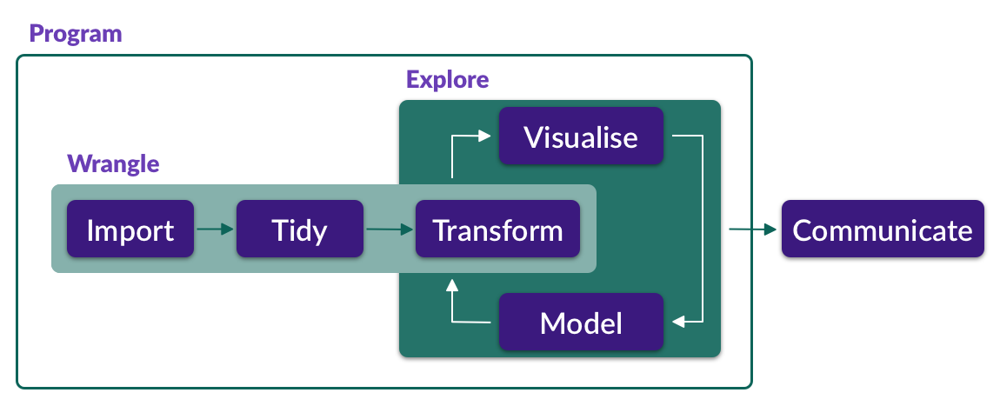

```{r setup, include=FALSE}
knitr::opts_chunk$set(echo = TRUE, warning = FALSE, message = FALSE, dpi = 300, fig.width = 7, fig.height = 5, out.height = "500px", fig.align = "center")
knitr::opts_knit$set(root.dir = here::here())
options(htmltools.dir.version = FALSE)
library(tidyverse)
theme_set(theme_light())
library(magrittr)
library(xaringanExtra)
use_xaringan_extra(c("panelset", "tachyons", "freezeframe"))
library(ggmosaic)
library(ggrepel)

library(glottologR)
data("glot_aes")

library(sqmf)
data("polite")
data("mald_1_1")
data("gestures")
gestures %<>% mutate(months = as.factor(months))
```

```{r xaringan-themer, include=FALSE, warning=FALSE}
library(xaringanthemer)
style_mono_light(
  base_color = "#23395b",
  text_font_google = google_font("Lato", "400", "700", "400i", "700i"),
  header_font_google = google_font("Montserrat", "400", "700", "400i", "700i"),
  code_font_google = google_font("Source Code Pro", "400", "700")
)
```

# Update the sqmf package

Time to update the sqmf package (if you haven't already)!

Run the following in the console:

``` r
remotes::install_github("stefanocoretta/sqmf")
```

---

# The data analysis pipeline

.center[

]

???

Week 2 was dedicated to "Visualise". Week 3 is about "Transform" and "Model".

"Import" and "Tidy" will be dealt with later on.

---

# Transform

These are the main **transformation** operations:

<br>

- `fiter()`: Filter data based on specific columns. For example, get data from L2 participants only.

- `mutate()`: Add new columns (or modify existing columns) based on operations applied to other columns/data/etc.

- `count()`: Count occurrences in the data based on the values of one or more columns.

---

# Model

We will focus on modelling data using **linear models**.

- A linear model:

  ```r
  lm_1 <- lm(price ~ carat, data = diamonds)
  ```

  - Model the relationship between `carat` and `price`.

  - `carat` is a **predictor variable** ans `price` is the **outcome variable**.

- In this linear model, both the outcome and the predictor variables are **continuous**.

???

**Outcome variable**

- The variable to the left of `~`.
- Also known as *dependent variable*.

**Predictor variable(s)**

- The variable(s) to the right of `~`.
- Also known as *independent variable*.

---

class: middle center inverse

.f1[TUTORIALS]

???

You can run tutorials also from the console!

`learnr::use_tutorial("03a_transform", "sqmf")`

`learnr::use_tutorial("03b_lm_basics", "sqmf")`

