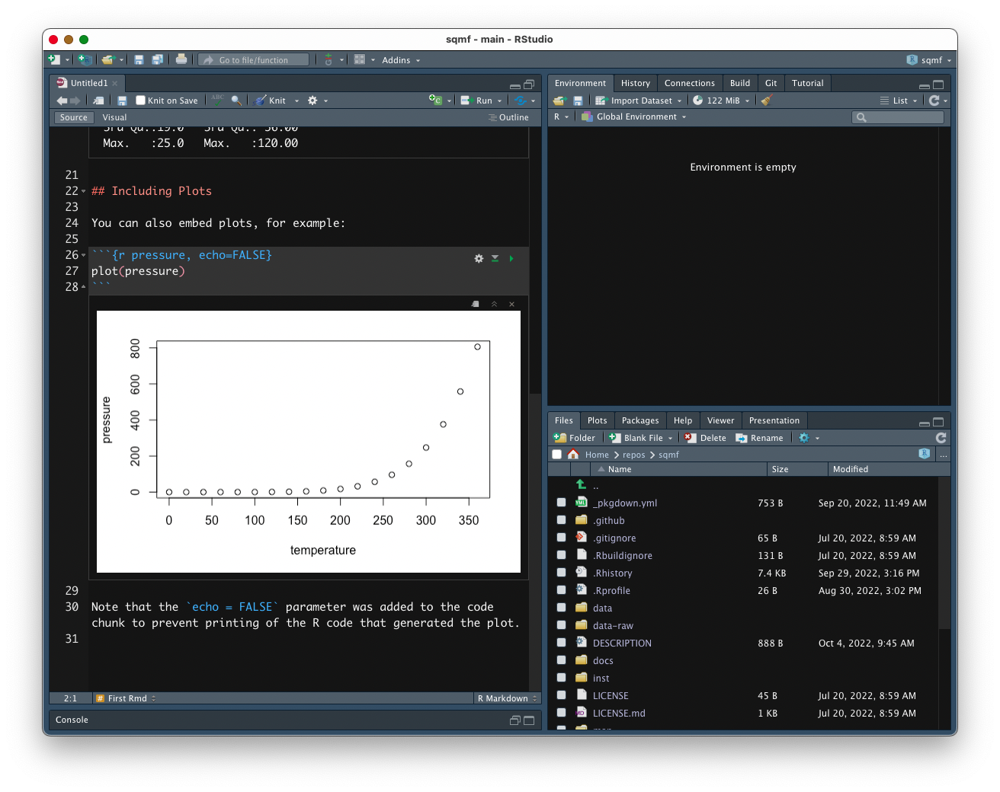

```{r setup, include=FALSE}
knitr::opts_chunk$set(echo = TRUE, warning = FALSE, message = FALSE, dpi = 300, fig.width = 7, fig.height = 5, out.height = "500px", fig.align = "center")
knitr::opts_knit$set(root.dir = here::here())
options(htmltools.dir.version = FALSE)
library(tidyverse)
theme_set(theme_light())
library(magrittr)
library(xaringanExtra)
use_xaringan_extra(c("panelset", "tachyons", "freezeframe"))
library(ggmosaic)
library(ggrepel)

library(glottologR)
data("glot_aes")

library(sqmf)
data("polite")
data("mald_1_1")
data("gestures")
gestures %<>% mutate(months = as.factor(months))
```

```{r xaringan-themer, include=FALSE, warning=FALSE}
library(xaringanthemer)
style_mono_light(
  base_color = "#23395b",
  text_font_google = google_font("Lato", "400", "700", "400i", "700i"),
  header_font_google = google_font("Montserrat", "400", "700", "400i", "700i"),
  code_font_google = google_font("Source Code Pro", "400", "700")
)
```

# Update the sqmf package

Time to update the sqmf package (if you haven't already)!

Run the following in the console:

``` r
remotes::install_github("stefanocoretta/sqmf")
```

---

# Rmarkdown

.pull-left[
**R scripts:**

* They have the `.R` file extension.

* You write code in the script.

* You can add text as comments (lines starting with `#`).

* Plots are shown in the `Plot` tab of the bottom-right panel.

* It can look busy.

]

--

.pull-right[
**Rmarkdown document:**

* They have the `.Rmd` file extension.

* You write text as you would in a common text file.

* You write code inside "code chunks".

* Plots are shown in the file, after their code chunk.

* You can format text using the [markdown](https://www.markdowntutorial.com/) syntax.

* You can render it to HTML or PDF to create analysis reports.
]

---

layout: true

# Create a new Rmarkdown (`.Rmd`) file

---

.center[

]

---

.center[

]

---

.center[

]

---

.center[

]

---

.center[

]

---

.center[

]

---

layout: false
layout: true

# Reading data

---

So far we worked with **ready-made data** provided by the sqmf package.
**But what about reading in your data?**

--

.pull-left[

**Easy!** We can use the `read_csv()` function from the tidyverse.
]


.pull-right[
.center[

]
]

???

Photo by <a href="https://unsplash.com/@karakupf?utm_source=unsplash&utm_medium=referral&utm_content=creditCopyText">Kara Kupfer</a> on <a href="https://unsplash.com/s/photos/happy-pug?utm_source=unsplash&utm_medium=referral&utm_content=creditCopyText">Unsplash</a>
  
---

layout: false

background-image: url(../../img/scott-rodgerson-BwMcYuHI9OI-unsplash.jpg)
background-size: cover


???

Photo by <a href="https://unsplash.com/@scottrodgerson?utm_source=unsplash&utm_medium=referral&utm_content=creditCopyText">Scott Rodgerson</a> on <a href="https://unsplash.com/s/photos/warning?utm_source=unsplash&utm_medium=referral&utm_content=creditCopyText">Unsplash</a>
  
