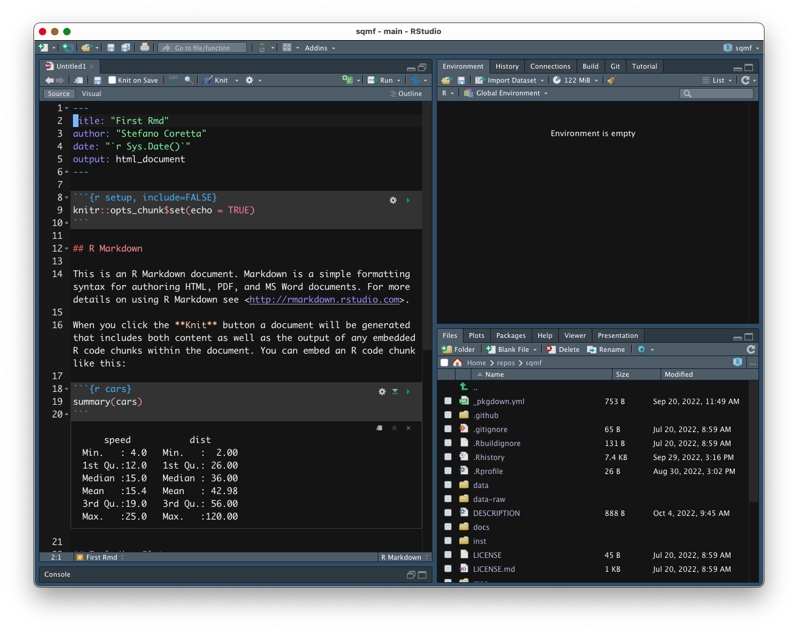

```{r setup, include=FALSE}
knitr::opts_chunk$set(echo = TRUE, warning = FALSE, message = FALSE, dpi = 300, fig.width = 7, fig.height = 5, out.height = "500px", fig.align = "center")
knitr::opts_knit$set(root.dir = here::here())
options(htmltools.dir.version = FALSE)
library(tidyverse)
theme_set(theme_light())
library(magrittr)
library(xaringanExtra)
use_xaringan_extra(c("panelset", "tachyons", "freezeframe"))
library(ggmosaic)
library(ggrepel)

library(glottologR)
data("glot_aes")

library(sqmf)
data("polite")
data("mald_1_1")
data("gestures")
gestures %<>% mutate(months = as.factor(months))
```

```{r xaringan-themer, include=FALSE, warning=FALSE}
library(xaringanthemer)
style_mono_light(
  base_color = "#23395b",
  text_font_google = google_font("Lato", "400", "700", "400i", "700i"),
  header_font_google = google_font("Montserrat", "400", "700", "400i", "700i"),
  code_font_google = google_font("Source Code Pro", "400", "700")
)
```

# Update the sqmf package

Time to update the sqmf package (if you haven't already)!

Run the following in the console:

``` r
remotes::install_github("stefanocoretta/sqmf")
```

---

# Rmarkdown

.pull-left[
**R scripts:**

* They have the `.R` file extension.

* You write code in the script.

* You can add text as comments (lines starting with `#`).

* Plots are shown in the `Plot` tab of the bottom-right panel.

* It can look busy.

]

--

.pull-right[
**Rmarkdown document:**

* They have the `.Rmd` file extension.

* You write text as you would in a common text file.

* You write code inside "code chunks".

* Plots are shown in the file, after their code chunk.

* You can format text using the [markdown](https://www.markdowntutorial.com/) syntax.

* You can render it to HTML or PDF to create analysis reports.
]

---

layout: true

# Create a new Rmarkdown (`.Rmd`) file

---

.center[

]

---

.center[

]

---

.center[

]

---

.center[

]

---

.center[

]

---

.center[

]

---

layout: false
layout: true

# Reading data

---

So far we worked with **ready-made data** provided by the sqmf package.
**But what about reading in your data?**

--

.pull-left[

**Easy!** We can use the `read_csv()` function from the tidyverse.
]


.pull-right[
.center[

]
]

???

Photo by <a href="https://unsplash.com/@karakupf?utm_source=unsplash&utm_medium=referral&utm_content=creditCopyText">Kara Kupfer</a> on <a href="https://unsplash.com/s/photos/happy-pug?utm_source=unsplash&utm_medium=referral&utm_content=creditCopyText">Unsplash</a>
  
---

layout: false
class: center middle inverse

background-image: url(../../img/scott-rodgerson-BwMcYuHI9OI-unsplash.jpg)
background-size: cover

.f1[ARE YOU IN A<br>RSTUDIO PROJECT?]

???

Photo by <a href="https://unsplash.com/@scottrodgerson?utm_source=unsplash&utm_medium=referral&utm_content=creditCopyText">Scott Rodgerson</a> on <a href="https://unsplash.com/s/photos/warning?utm_source=unsplash&utm_medium=referral&utm_content=creditCopyText">Unsplash</a>
  
---

layout: true

# Reading data

---

Fundamental concepts:

- **Working directory**:

  - This is the directory (i.e. folder) which is set as the folder you are working from.
  - You can check this in R with `getwd()`.
  - When using RStudio projects, the working directory is your project's folder.

--

- **File paths**:
  
  - A file path is the "address" of a file on your computer.
    For example: `"/Users/stefano/Documents/sqmf/script_1.R"`

--

- There are **two ways** of specifying file paths:

  - **Absolute paths**: `"/Users/stefano/projects/voicing/code/analysis.R"`
  - **Relative paths**: `"./code/analysis.R"`
    - Relative paths are relative to the **working directory**.
    - The `"./"` part means "start from the working directory".

---

layout: false
class: center middle inverse

# Please use RStudio projects and relative paths!

---

layout: true

# Reading data

---

- The `read_csv()` function reads `.csv` files into R as a tibble (data frame, data table).

- It takes at least one argument: the `file` path (as a string).

<br>

``` r
vot_df <- read_csv("./data/vot.csv")
vot_df
```

<br>

- `"./data/vot.csv"` is a relative path.

---

When working with file paths, you can use **RStudio auto-complete**:

- Start by typing `read_csv("")`.

- Then move the text cursor between the `""`.

- Press `TAB` and a list of files and folders from the working directory will be displayed.

- You can navigate the list with the arrow keys and ENTER.

---

layout: false
layout: true

# Rmarkdown

---

Rmarkdown files start with a **YAML preamble**.

```yaml
---
title: "My first Rmd file"
author: "Stefano"
date: "2022-10-11"
output: html_document
---
```

--

You specify some info or settings about the document in the YAML preamble using `key: value` pairs.

---

Then you can start writing text using **markdown**!

```md
# A title (H1)

Some text, this is **bold**.

## Another title (H2)

Some more *italics* text and a list:

- Apples.
- Pears.
- Oranges.
```

---

.center[

]

And code... in **code chunks**.

- Code chunks are created by "fencing" code with **three backticks**.

  - Lines 26 and 28 in the picture above.

- Everything between the lines with backticks must be working R code.

--

- The opening backticks are followed by `{r pressure, echo=FALSE}`.

--

- In the top-right corner of the code chunk there are three buttons: (1) Code chunk settings, (2) Run all code above, (3) Run the code of the current chunk.

---

layout: false
class: center middle inverse

# R MARKDOWN TUTORIAL

---

# Instructions

1. Download the following files (right-click on the `Raw` button and download):
  - `alb_vot.csv` from <TBA>.
  - `04_lm_cat.Rmd` from <TBA>.
  
1. Download the pupillometry data from <TBA>.

3. Copy `04_lm_cat.Rmd` to the `code` folder in your RStudio project.

4. Copy `alb_vot.csv` and `...csv` to the `data` folder in your RStudio project.
