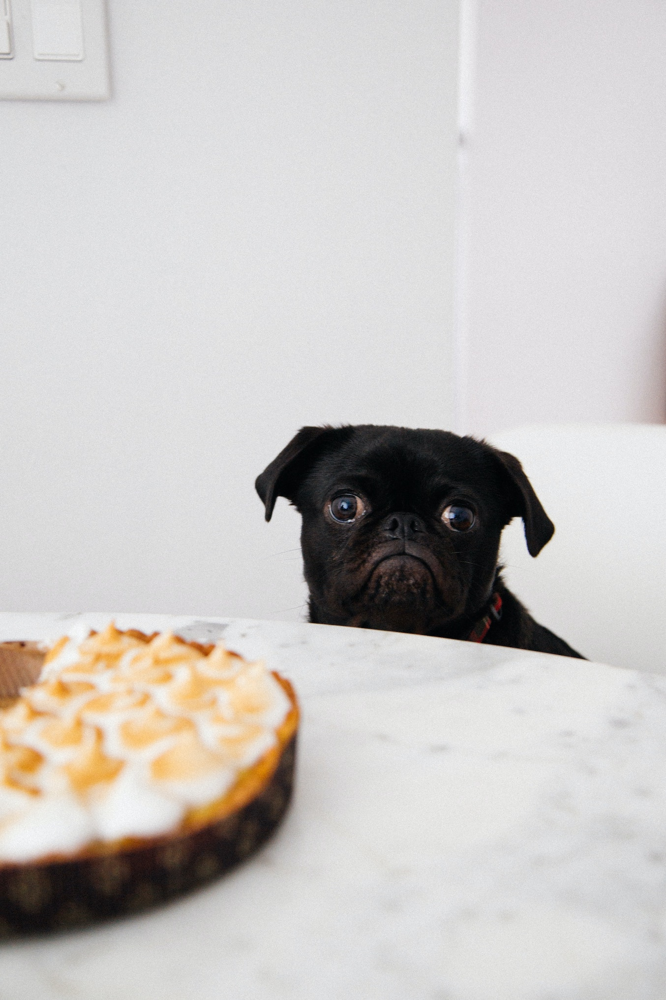

```{r setup, include=FALSE}
knitr::opts_chunk$set(echo = FALSE, message = FALSE, dpi = 300, out.height = "500px", fig.align = "center")
knitr::opts_knit$set(root.dir = here::here())
options(htmltools.dir.version = FALSE)
library(tidyverse)
theme_set(theme_light())
library(xaringanExtra)
use_xaringan_extra(c("panelset", "tachyons", "freezeframe"))
library(ggeffects)
options(show.signif.stars = FALSE)
library(broom.mixed)
library(sqmf)
data("polite")
polite <- polite %>%
  mutate(
    attitude = factor(attitude, levels = c("inf", "pol")),
    musicstudent = factor(musicstudent, levels = c("no", "yes"))
  )
data("shallow")
data("gestures")
```

```{r xaringan-themer, include=FALSE, warning=FALSE}
library(xaringanthemer)
style_mono_light(
  base_color = "#23395b",
  text_font_google = google_font("Lato", "400", "700", "400i", "700i"),
  header_font_google = google_font("Montserrat", "400", "700", "400i", "700i"),
  code_font_google = google_font("Source Code Pro", "400", "700")
)
```

# Summary

* The simplest .orange[**linear model**] is a straight line.

$$y = \beta_0 + \beta_1 x$$

* We want to estimate the $\beta_n$ .orange[**coefficients**].

$$y = \beta_0 + \beta_1 x_1 + \beta_2 x_2 + \beta_3 x_3$$

* Categorical predictors are .orange[coded as numbers].

* The default coding system ("treatment contrasts") sets the intercept as the mean of the first level (the "reference level").

* The other levels of the categorical predictor are compared to the reference level.


---

class: center middle



???

Photo by <a href="https://unsplash.com/@charlesdeluvio?utm_source=unsplash&utm_medium=referral&utm_content=creditCopyText">charlesdeluvio</a> on <a href="https://unsplash.com/s/photos/sad-puppy?utm_source=unsplash&utm_medium=referral&utm_content=creditCopyText">Unsplash</a>
  
---

class: center middle


???

Photo by <a href="https://unsplash.com/@joeyc?utm_source=unsplash&utm_medium=referral&utm_content=creditCopyText">Joe Caione</a> on <a href="https://unsplash.com/s/photos/happy-puppy?utm_source=unsplash&utm_medium=referral&utm_content=creditCopyText">Unsplash</a>

---

layout: true

# Exercise 1

---

```{r art-rate}
art_lm_1 <- lm(articulation_rate ~ attitude + musicstudent, data = polite)

summary(art_lm_1)
```

---

```{r art-rate-plot}
ggpredict(art_lm_1, terms = c("attitude", "musicstudent")) %>%
  plot() +
  theme(text = element_text(size = 20))
```

---

layout: false
layout: true

# Exercise 2

---

```{r f0}
f0_lm_1 <- lm(f0mn ~ attitude + months_ger + gender, data = polite)

summary(f0_lm_1)
```

---

```{r f0-plot}
ggpredict(f0_lm_1, terms = c("attitude", "months_ger [0, 24, 48]", "gender"), condition = ) %>%
  plot() +
  theme(text = element_text(size = 20))
```

---

layout: false

# Shallow Morphological Processing

- English L1 and L2 speakers (L2 speakers are native speakers of Cantonese).

- Lexical decision task (Word vs Non-Word).

- Target: *unkindness* ([[un]-[kind]]-ness).

- Primes: *prolong* (Unrelated), *unkind* (Constituent), *kindness* (Non-Constituent).

---

# This doesn't work!

```{r shallow, eval=FALSE, echo=TRUE}
shallow_lm <- lm(accuracy ~ Word_Nonword + accuracy, data = shallow)
```

```
Error in `contrasts<-`(`*tmp*`, value = contr.funs[1 + isOF[nn]]) : 
    contrasts can be applied only to factors with 2 or more levels
```

--

<br>

What is the difference between this model and the models we have run so far?

(**NOTE:** the error message is absolutely NOT helpful!)

--

<br>

**Hint:** Compare the the outcome variables.

---

layout: false
class: center middle inverse

# Probability distributions

---

class: middle

.pull-left[

]

.pull-right[

]

???

We are faced every day with probabilities. Just think about the weather forecast.

We say things like t"here is a 70% prob that it will rain today". In this sense, probability is the probability of an event occurring.

But what about more complex situations that are not a flip-of-coin kinda situation? For example what about rolling two dice?

Here is where probability distributions come in.

---

# Grubabilities

&nbsp;

.center[

]

???

A probability distribution is a list of values and their corresponding probability.

---

# Discrete and continuous

.center[

]

???

Remember we talked about continuous and discrete variables?

This distinction is helpful not only when deciding which type of plot to use, but also which type of linear model to use!

Or more specifically, which probability distribution to use for the outcome variable. This week's classes will be about this!

Depending on the nature of the values a variable can take, there are 2 types of probs.


---

# Discrete probability distributions

.center[

]

???


A discrete probability distributions is like counting how many ways you can get a particular value.

For example, if you roll a white and a black dice, there are 3 ways to get a 4 or a 10, but 6 ways to get a 7.

---

layout: true

# Continuous probability distributions

---

```{r cont-p, echo=FALSE}
x <- seq(0, 400)
ggplot() +
  aes(x = x, y = dnorm(x, 200, 50)) +
  geom_line(size = 2) +
  labs(
    x = "f0 (Hz)", y = "Density",
    title = "Gaussian distribution",
    subtitle = expression(paste(mu, "=200", ", ", sigma, "=50"))
  )
```

???

With continuous probabilities we cannot make a list of all the possible values (0.0, 0.00, 0.000, 0.0001...), because there is an infinite number of possible values. So we cannot assign a probability to a specific value.

Instead, we assign probabilities to a range of values.

---

```{r cont-p-2, echo=FALSE}
x <- seq(0, 400)
y = dnorm(x, 200, 50)
ggplot() +
  aes(x, y) +
  geom_ribbon(aes(x = ifelse(x < 160.0001 , x, NA), ymin = 0, ymax = y), alpha = 0.5, fill = "#FFA70B") +
  geom_line(size = 2) +
  scale_x_continuous(breaks = c(0, 100, 160, 200, 300, 400)) +
  labs(
    x = "f0 (Hz)", y = "Density",
    title = "Gaussian distribution",
    subtitle = expression(paste(mu, "=200", ", ", sigma, "=50"))
  )
```

???

In this example, we want to know the probability of observing an f0 value between 0 and 160 Hz, assuming the probability distribution represented in the graph.

We simply calculate the area under the curve between those two values (note that the total area under the curve is 1).

The probability of f0 being less than 160 Hz is `r round(pnorm(160, 200, 50), digits = 3)`.

---

```{r cont-p-3, echo=FALSE}
x <- seq(0, 400)
y = dnorm(x, 200, 50)
ggplot() +
  aes(x, y) +
  geom_ribbon(aes(x = ifelse(x > 219.999 , x, NA), ymin = 0, ymax = y), alpha = 0.5, fill = "#FFA70B") +
  geom_line(size = 2) +
  scale_x_continuous(breaks = c(0, 100, 200, 220, 300, 400)) +
  labs(
    x = "f0 (Hz)", y = "Density",
    title = "Gaussian distribution",
    subtitle = expression(paste(mu, "=200", ", ", sigma, "=50"))
  )
```

???

The probability of f0 being greater than 220 Hz is `r round(pnorm(220, 200, 50, lower.tail = FALSE), digits = 3)`.

---

```{r cont-p-4, echo=FALSE}
x <- seq(0, 400)
y = dnorm(x, 200, 50)
ggplot() +
  aes(x, y) +
  geom_ribbon(aes(x = ifelse(x > 119.999 & x < 210.001 , x, NA), ymin = 0, ymax = y), alpha = 0.5, fill = "#FFA70B") +
  geom_line(size = 2) +
  scale_x_continuous(breaks = c(0, 100, 120, 200, 210, 300, 400)) +
  labs(
    x = "f0 (Hz)", y = "Density",
    title = "Gaussian distribution",
    subtitle = expression(paste(mu, "=200", ", ", sigma, "=50"))
  )
```

???

The probability of f0 being between 120 and 210 Hz is `r round(pnorm(210, 200, 50) - pnorm(120, 200, 50), digits = 3)`

---

But how do we describe probability distributions in a succint way?

We can't make a list of all values and probabilities, especially for continuous probabilities.

--

.bg-washed-blue.b--dark-blue.ba.bw2.br3.shadow-5.ph4.mt5[

Instead, we specify the value of the **parameters that describe the distribution**.

]

---

layout: false
class: center middle

.f1.link.dim.br3.ph3.pv2.mb2.dib.white.bg-purple[
[.white[Web App: Probability distributions]](https://seeing-theory.brown.edu/probability-distributions/index.html#section2)
]

<!-- <iframe src="https://seeing-theory.brown.edu/probability-distributions/index.html#section2" style="border:none;" width="100%" height="100%"> -->

---
class: middle

<span style="font-size:3.5em;">$$y_i \sim Normal(\mu, \sigma)$$</span>

???

Let's look at some formulae.

This is the formula of a variable $y_1$ that is distributed according to (~) a Normal probability distribution.

As we have seen in the example above, a Normal distribution can be described with two parameters: the mean and the standard deviation.

---

class: middle

<span style="font-size:3.5em;">$$\text{f0}_i \sim Normal(200, 50)$$</span>

???

Remember the example above of a Gaussian/Normal distribution of f0?

We can describe that distribution with this formula (much easier than listing all the values and their probability).

---

class: center middle inverse

# Think about the probability distribution of the outcome variable

---

# Common probability distributions


.pull-left[
**Continuous outcome variable**

* The variable can take on *any positive and negative real number, including 0*: **Gaussian** (aka normal) distribution.

    * There are very few truly Gaussian variables, although in some cases one can speak of "approximate" or "assumed" normality.
    
    * This distribution family is fitted by default in `lm(...)`.
]

--

.pull-right[
**Discrete outcome variable**

* The variable is *counts*: **Poisson** distribution.
  * Counts of words, segments, gestures, f0 peaks, ...
  
  * This family can be fitted with `glm(..., family = poisson)`.

* The variable is *dichotomous*, i.e. it can take one of two levels: **Bernoulli** distribution.
  * Categorical outcome variables like yes/no, correct/incorrect, voiced/voiceless, follow this distribution.
  
  * This family is fitted when you run `glm(..., family = binomial)`, aka "logistic regression" or "binomial regression".
]

???

Note that `glm()` stands for Generalised Linear Model.

It's called "generalised" because the maths behind it generalises the use of linear models with the Gaussian distribution family to other distribution families.

But from a practical point of view, these are all linear models, whether you fit them with `lm()` or `glm()`.

---

layout: true

# Dichotomous variables: Accuracy

---

```{r shallow-2}
shallow <- shallow %>%
  mutate(
    accuracy = factor(accuracy, levels = c("incorrect", "correct"))
  )

shallow %>% select(ID, accuracy, Relation_type)
```

---

```{r shallow-plot}
shallow %>%
  ggplot(aes(accuracy, fill = accuracy)) +
  geom_bar()
```

???

You can clearly see that `"correct"` is much more frequent than `"incorrect"`.

In other words, the probability of getting `"correct"` is greater than the probability of getting `"incorrect"`.

---

```{r shallow-plot-1}
shallow %>%
  ggplot(aes(Relation_type, fill = accuracy)) +
  geom_bar()
```

???

What happens if we separate by `Releation_type`?

You can still see that `"correct"` is more frequent than `"incorrect"` in all relation types, but since each type has a different number of observations it is not easy to compare *across* types.

---

```{r shallow-plot-2}
shallow %>%
  ggplot(aes(Relation_type, fill = accuracy)) +
  geom_bar(position = "fill") +
  labs(y = "Proportion")
```

???

In this plot, we use `position = "fill"` to plot *proportions* rather than raw counts.

Now you can see that, proportionally, there are more correct responses in `Constituent` vs `NonConstituent` and that `Unrelated` is sorta mid-way through the other two.

---

.bg-washed-blue.b--dark-blue.ba.bw2.br3.shadow-5.ph4.mt5[

When the outcome variable is **dichotomous**, we need to estimate the **probability** of getting either level in the variable.

]

--

In the `shallow` data:

- `accuracy` is dichotomous with levels `"inaccurate"` and `"accurate"`
- `Relation_type` is discrete with three levels: `Unrelated`, `Constituent`, `NonConstituent`.

So, we want to know (i.e. estimate) the probability of getting a `"correct"` response depending on `Relation_type`.

---

```{r shallow-lm-1}
shallow_lm_1 <- glm(accuracy ~ Relation_type, data = shallow, family = binomial())

summary(shallow_lm_1)
```

???

Here's the summary of `shallow_lm_1`.

Do you notice something weird?

---

layout: false
class: middle center inverse

# What is the unit of the estimates?!

???

Should be probabilities, because we are estimating probabilities.

But those cannot be probabilities, because probabilities are between 0 and 1.

---

class: middle center

# Probabilities as log-odds

???

Linear models cannot work with probabilities! 

So we need to transform probabilities into something the model can work with.

And that something is log-odds!

---

layout: true

# Probabilities and log-odds

---

```{r p-log-odds, warning=FALSE}
dots <- tibble(
  p = seq(0.1, 0.9, by = 0.1),
  log_odds = qlogis(p)
)

tibble(
  p = seq(0, 1, by = 0.001),
  log_odds = qlogis(p)
) %>%
  ggplot(aes(log_odds, p)) +
  geom_hline(yintercept = 0.5, linetype = "dashed") +
  geom_hline(yintercept = 0, colour = "#8856a7", size = 1) +
  geom_hline(yintercept = 1, colour = "#8856a7", size = 1) +
  geom_vline(xintercept = 0, alpha = 0.5) +
  geom_line(size = 2) +
  geom_point(data = dots, size = 4) +
  geom_point(x = 0, y = 0.5, colour = "#8856a7") +
  scale_x_continuous(breaks = seq(-6, 6, by = 1), minor_breaks = NULL, limits = c(-6, 6)) +
  scale_y_continuous(breaks = seq(0, 1, by = 0.1), minor_breaks = NULL) +
  labs(
    title = "Correspondence between log-odds and probabilities",
    x = "log-odds",
    y = "probability"
  )
```

---

```{r plogis, echo=TRUE}
# What is the probability at -1 log-odds?
plogis(-1)

# What is the probability at 0 log-odds?
plogis(0)

# What is the probability at 1 log-odds?
plogis(1)
```

--

<br>

Now try different numbers with `plogis()`.

---

```{r shallow-lm-1-3}
summary(shallow_lm_1)
```

---

```{r shallow-lm-1-predics}
ggpredict(shallow_lm_1, terms = "Relation_type")
```

---

```{r shallow-lm-1-plot}
ggpredict(shallow_lm_1, terms = "Relation_type") %>%
  plot()
```


---

```{r shallow-lm-2}
shallow_lm_2 <- glm(accuracy ~ Relation_type + Group, data = shallow, family = binomial())

summary(shallow_lm_2)
```


---

```{r shallow-lm-2-plot}
ggpredict(shallow_lm_2, terms = c("Group"))
ggpredict(shallow_lm_2, terms = c("Relation_type"))
ggpredict(shallow_lm_2, terms = c("Relation_type", "Group"))
```

---

```{r shallow-lm-2-pred}
ggpredict(shallow_lm_2, terms = c("Group")) %>%
  plot()
ggpredict(shallow_lm_2, terms = c("Group", "Relation_type")) %>%
  plot()
```

---

```{r log-exp, echo=TRUE}
# What is the log of 1?
log(1)

# What is the exponential function at 0?
exp(0)
```

--

<br>

Now try different numbers with `log()` and `exp()`.

---

```{r log-odds}
tibble(
  log_odds = seq(-2, 2, by = 0.001),
  odds = exp(log_odds)
) %>%
  ggplot(aes(log_odds, odds)) +
  geom_vline(xintercept = 0, alpha = 0.5) +
  geom_hline(yintercept = 1, linetype = "dashed") +
  geom_hline(yintercept = 0, size = 1, colour = "#8856a7") +
  geom_line(size = 2) +
  geom_point(x = 0, y = 1, size = 4) +
  scale_y_continuous(breaks = seq(0, 6, by = 1), minor_breaks = NULL) +
  labs(
    title = "Correspondence between log-odds and odds",
    subtitle = "odds = exp(log-odds)",
    x = "log-odds",
    y = "odds"
  )
```

---

- 10 mo infants perform on average 10 iconic gestures per day. At 11 mo, the number of gestures increases by a factor of 1.6. At 12 mo, there is a further increase by a factor of 1.2.

--

  - Calculate the average number of gestures per day at 12 months based on the 10 month average (10 gestures).

--

- The average number of errors L2 learners make decreases by a factor of 0.2 every year and a half.

--

  - Calculate the average number of errors after 6 years, assuming 265 errors at year 1.
  
---

# Counts: Poisson distribution

```{r ct-2}
ct_lm_2 <- glm(ct ~ count, data = gestures, family = poisson())

summary(ct_lm_2)
```

---

```{r ct-2-plot}
ggpredict(ct_lm_2, terms = c("count [0:40 by=0.1]")) %>%
  plot()
```


---

```{r ct-3}
ct_lm_3 <- glm(ct ~ count + background, data = gestures, family = poisson())

summary(ct_lm_3)
```

---

```{r ct-lm-3-coefs, echo=TRUE}
tidy(ct_lm_3, exponentiate = FALSE)
```

---

```{r ct-lm-3-coefs-exp, echo=TRUE}
tidy(ct_lm_3, exponentiate = TRUE)
```


---

```{r ct-3-plot}
ggpredict(ct_lm_3, terms = c("count [0:30 by=0.1]", "background")) %>%
  plot()
```


