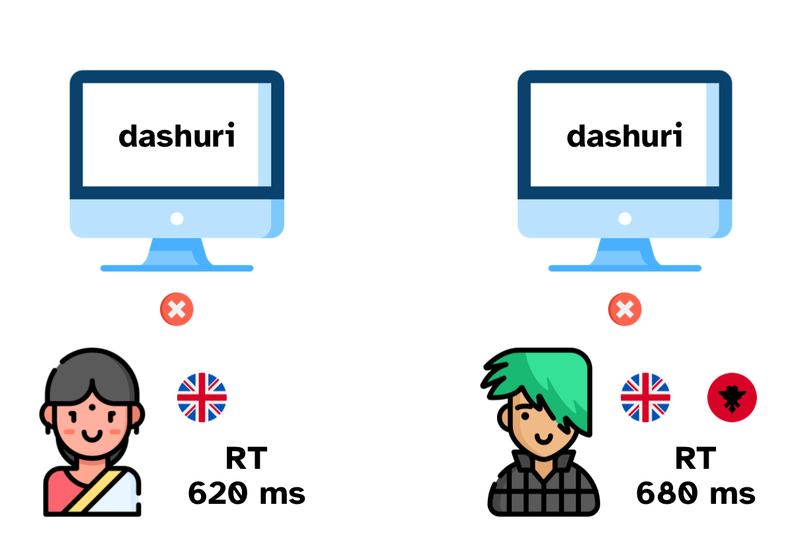
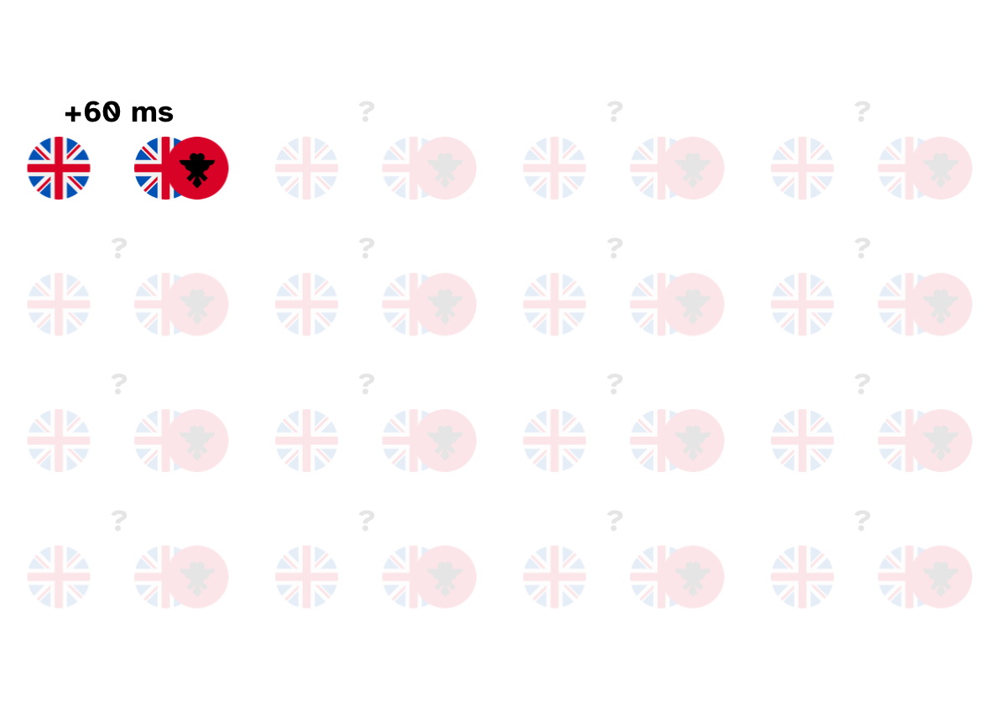
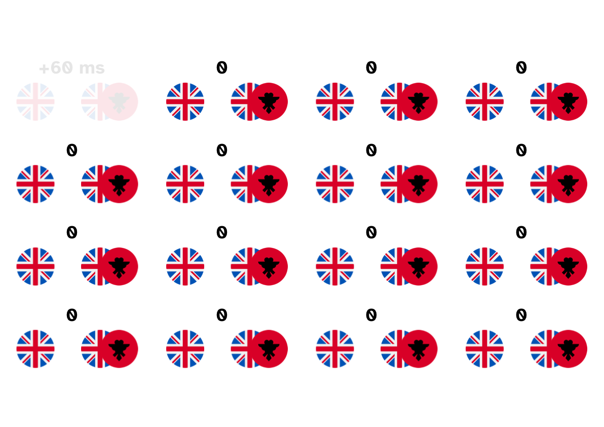
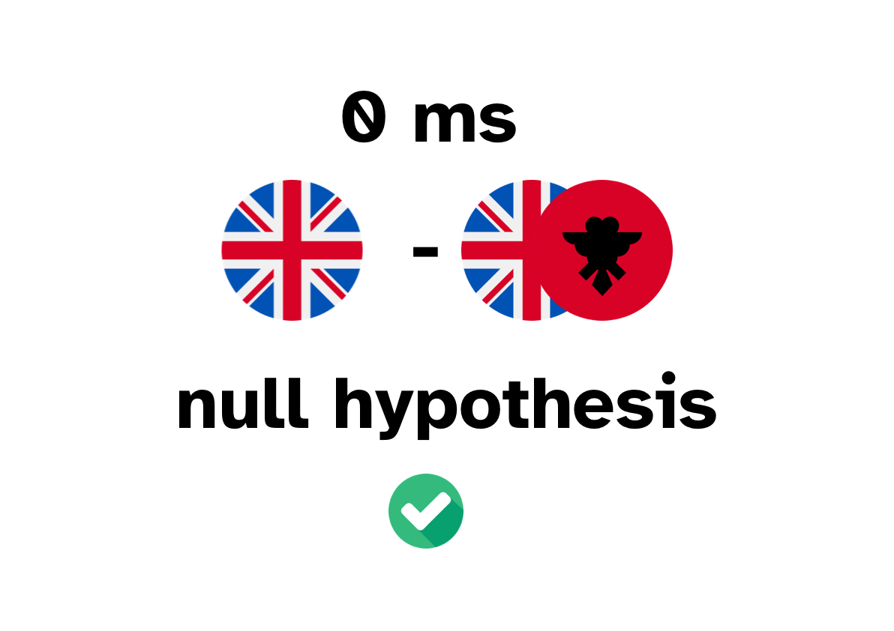

```{r setup, include=FALSE}
knitr::opts_chunk$set(echo = FALSE, message = FALSE, dpi = 300, out.height = "500px", fig.align = "center")
knitr::opts_knit$set(root.dir = here::here())
options(htmltools.dir.version = FALSE)
library(tidyverse)
theme_set(theme_light())
library(magrittr)
library(xaringanExtra)
use_xaringan_extra(c("panelset", "tachyons", "freezeframe"))
library(ggeffects)
library(marginaleffects)
options(show.signif.stars = FALSE)
library(broom.mixed)
library(sqmf)
data("mald_1_1")
data("shallow")
data("polite")
data("gestures")
data("dur_ita_pol")
dur_ita_pol %<>% drop_na(f1, v1_duration)
library(lme4)
library(patchwork)
```

```{r xaringan-themer, include=FALSE, warning=FALSE}
library(xaringanthemer)
style_mono_light(
  base_color = "#23395b",
  text_font_google = google_font("Lato", "400", "700", "400i", "700i"),
  header_font_google = google_font("Montserrat", "400", "700", "400i", "700i"),
  code_font_google = google_font("Source Code Pro", "400", "700")
)
```

class: center middle


---

class: center middle


---

class: center middle



---

class: center middle



---

class: center middle


---

class: center middle



---

## Difference between two groups

We have two hypotheses:

- **Null Hypothesis**: the difference between the means of Group A and B *is 0* (i.e. there is no difference).

- **Alternative Hypothesis**: the difference between the means of Group A and B *is not 0*.

--

<br/>

$$H_0: \mu_a - \mu_b = 0$$

$$H_1: \mu_a - \mu_b \neq 0$$


---

class: center middle




---

class: center middle

```{r null-probs, fig.width=13, fig.height=7, dpi=600, fig.retina=TRUE}
x <- seq(-4, 4, by = 0.01)
y <- dnorm(x)
labels <- tibble(
  x = c(0, 2, -2, -2.5, 2),
  y = c(-0.025, -0.025, -0.025, 0.36, 0.1),
  labs = c("0", "positive diff", "negative diff", "high probability", "low probability")
)
arrows <- tibble(
  x1 = c(-1.5, 2.5),
  y1 = c(0.4 - 0.025, 0.1 - 0.025),
  x2 = c(-0.4, 3),
  y2 = c(0.4 - 0.015, 0.025)
)
ggplot() +
  aes(x, y) +
  geom_ribbon(aes(ymin = 0, ymax = y), fill = "#7570b3", alpha = 0.4) +
  geom_segment(aes(x = 0, y = 0, xend = 0, yend = max(y)), colour = "#1b9e77", linewidth = 3) +
  geom_text(data = labels, aes(x, y, label = labs), size = 10, family = "Atkinson Hyperlegible") +
  geom_curve(
    data = arrows, aes(x = x1, y = y1, xend = x2, yend = y2),
    arrow = arrow(length = unit(0.3, "inch"), type = "closed"), linewidth = 1,
    color = "gray20", curvature = -0.3
  ) +
  theme_void() + labs(x = "Difference between groups") + theme(axis.title.x = element_text(size = 18))
```

---

class: center middle

```{r rare-events, fig.width=13, fig.height=7, dpi=600, fig.retina=TRUE}
x <- seq(-4, 4, by = 0.01)
y <- dnorm(x)
labels <- tibble(
  x = c(0, 2, -2, -2.5, 3),
  y = c(-0.025, -0.025, -0.025, 0.36, 0.15),
  labs = c("0", "<- smaller diff     -     bigger diff ->", "<- bigger diff     -     smaller diff ->", "high probability", "RARE\nEVENT")
)
arrows <- tibble(
  x1 = c(-1.5, 3),
  y1 = c(0.4 - 0.025, 0.1 - 0.025),
  x2 = c(-0.4, 3),
  y2 = c(0.4 - 0.015, 0.025)
)
ggplot() +
  aes(x, y) +
  geom_ribbon(aes(ymin = 0, ymax = y), fill = "#7570b3", alpha = 0.4) +
  geom_segment(aes(x = 0, y = 0, xend = 0, yend = max(y)), colour = "#1b9e77", linewidth = 3) +
  geom_text(data = labels, aes(x, y, label = labs), size = c(10, 8, 8, 10, 10), family = "Atkinson Hyperlegible", colour = c("black", "#d95f02", "#d95f02", "black", "#d95f02")) +
  geom_curve(
    data = arrows, aes(x = x1, y = y1, xend = x2, yend = y2),
    arrow = arrow(length = unit(0.3, "inch"), type = "closed"), linewidth = 1,
    color = c("gray20", "#d95f02"), curvature = -0.3
  ) +
  theme_void() + labs(x = "Difference between groups") + theme(axis.title.x = element_text(size = 18))
```

---

layout: true

## Student's *t*-statistic

---

- We need a standardised measure of difference.

--

- One such measure is the **Student's *t*-statistic**.

$$t = \frac{\mu_b - \mu_a}{\sqrt{\frac{\sigma^2_a}{n_a} + \frac{\sigma^2_b}{n_b}}}$$

where:

- $\mu_a$ and $\mu_b$ are the means of group A and B.

- $\sigma^2_a$ and $\sigma^2_b$ are the squared standard deviations (i.e. variances) of group A and B.

- $n_a$ and $n_b$ are the sample sizes of group A and B.

---

```{r mono, echo=TRUE}
mono <- rnorm(n = 100, mean = 620, sd = 200)
mono
```

---

```{r exp, echo=TRUE}
mono <- rnorm(n = 100, mean = 620, sd = 200)
bi <- rnorm(100, 680, 200)

exp <- tibble(
  rt = c(mono, bi),
  group = rep(c("mono", "bi"), each = 100)
)
exp
```

---

```{r exp-plot}
exp %>%
  ggplot(aes(rt, fill = group)) +
  geom_density(alpha = 0.5)
```

---

$$t = \frac{\mu_b - \mu_a}{\sqrt{\frac{\sigma^2_a}{n_a} + \frac{\sigma^2_b}{n_b}}}$$

--

<br/>

$$t = \frac{680 - 620}{\sqrt{\frac{200^2}{100} + \frac{200^2}{100}}}$$

<br/>

$$t = 2.12132$$

---

```{r tplot}
x <- seq(-4, 4, by = 0.005)
y <- dt(x, 198)

tplot <- ggplot() +
  aes(x, y) +
  geom_vline(xintercept = 0, colour = "gray", linewidth = 1) +
  geom_hline(yintercept = 0, colour = "gray", linewidth = 1) +
  geom_path() +
  labs(title = "Student's t-distribution")

tplot
```

---

```{r tplot-1}
tplot + annotate("point", x = 2.12132, y = 0, colour = "#d95f02", size = 3) +
  geom_vline(xintercept = 2.12132, colour = "#d95f02") +
  annotate("text", x = 2.5, y = -0.025, colour = "#d95f02", label = "2.12")
```

---

layout: false
layout: true

## *p*-value

---

```{r tplot-2}
tplot + annotate("point", x = 2.12132, y = 0, colour = "#d95f02", size = 3) +
  geom_vline(xintercept = 2.12132, colour = "#d95f02") +
  annotate("text", x = 2.5, y = -0.025, colour = "#d95f02", label = "2.12") +
  annotate("text", x = 3, y = 0.05, label = "p = 0.0176") +
  geom_ribbon(
    aes(x = ifelse(x >= 2.12132, x, NA), ymin = 0, ymax = y),
    fill = "#E84646",
    alpha = 0.4
  )
```

---

```{r tplot-3}
tplot + annotate("point", x = 2.12132, y = 0, colour = "#d95f02", size = 3) +
  annotate("text", x = 2.5, y = -0.025, colour = "#d95f02", label = "2.12") +
  annotate("text", x = 3, y = 0.05, label = "p = 0.0176") +
  geom_ribbon(
    aes(x = ifelse(x >= 2.12132, x, NA), ymin = 0, ymax = y),
    fill = "#E84646",
    alpha = 0.4
  ) +
  annotate("label", x = 0, y = 0.35, label = "p-value = The probability of finding a certain difference,\nor a bigger difference,\nassuming that there is no difference", size = 5)
```

???

`r pt(2.12, 198, lower.tail = FALSE)`

---

```{r tplot-4}
tplot + annotate("point", x = 2.12132, y = 0, colour = "#d95f02", size = 3) +
  annotate("text", x = 2.5, y = -0.025, colour = "#d95f02", label = "2.12") +
  annotate("point", x = -2.12132, y = 0, colour = "#d95f02", size = 3) +
  annotate("text", x = -2.5, y = -0.025, colour = "#d95f02", label = "-2.12") +
  annotate("text", x = 3, y = 0.05, label = "p = 0.0176") +
  annotate("text", x = -3, y = 0.05, label = "p = 0.0176") +
  geom_ribbon(
    aes(x = ifelse(x >= 2.12132, x, NA), ymin = 0, ymax = y),
    fill = "#E84646",
    alpha = 0.4
  ) +
  geom_ribbon(
    aes(x = ifelse(x <= -2.12132, x, NA), ymin = 0, ymax = y),
    fill = "#E84646",
    alpha = 0.4
  ) +
  annotate("label", x = 0, y = 0.35, label = "p-value = The probability of finding a certain difference,\nor a bigger difference,\nassuming that there is no difference", size = 5)
```

---

```{r tplot-6}
tplot + annotate("point", x = 2.12132, y = 0, colour = "#d95f02", size = 3) +
  annotate("text", x = 2.5, y = -0.025, colour = "#d95f02", label = "2.12") +
  annotate("point", x = -2.12132, y = 0, colour = "#d95f02", size = 3) +
  annotate("text", x = -2.5, y = -0.025, colour = "#d95f02", label = "-2.12") +
  annotate("text", x = 3, y = 0.05, label = "p = 0.0176", colour = "gray") +
  annotate("text", x = -3, y = 0.05, label = "p = 0.0176", colour = "gray") +
  annotate("text", x = -3, y = 0.2, label = "p = 0.0176 * 2 =\n0.0352", size = 5) +
  geom_ribbon(
    aes(x = ifelse(x >= 2.12132, x, NA), ymin = 0, ymax = y),
    fill = "#E84646",
    alpha = 0.4
  ) +
  geom_ribbon(
    aes(x = ifelse(x <= -2.12132, x, NA), ymin = 0, ymax = y),
    fill = "#E84646",
    alpha = 0.4
  ) +
  annotate("label", x = 0, y = 0.35, label = "p-value = The probability of finding a certain difference,\nor a bigger difference,\nassuming that there is no difference", size = 5)
```

---

layout: false

## Two-tailed *t*-test and *p*-value

- Difference between means: 60 ms.

- *t*-statistic: 2.12.

- *p*-value: 0.0352

--

<br/>

**There is a 0.0352% probability that we would find a difference that is 60 ms or more, assuming that the null hypothesis (`\(H_0: \mu_a-\mu_b = 0\)`) is true.** 

--

<br/>

.f3[If *p* is small enough, we can reject the null hypothesis (that there is no difference).]

--

.f3[But **how small** is small enough?]

---

## The $\alpha$-level

We need to **set a threshold**, i.e. a value of *p* below which we decide to **reject the null hypothesis**.

--

<br/>

This threshold is known as the **α-level** and for most purposes:

.f1[
$$\alpha = 0.05$$
]

--

<br/>

In other words:

- If *p* < 0.05: we reject the null hypothesis.

- If *p* ≥ 0.05: we cannot reject the null hypothesis.

---

layout: true

## Null Hypothesis Significance Testing

---

This method of statistical inference is called **Null Hypothesis Significance Testing**, or NHST, or frequentist approach.

--

- The difference between two means is **significant** if the *p*-value is smaller than 0.05 (the α-level).

--

- The difference between two means is **not significant** if the *p*-value is equal to or greater than 0.05 (the α-level).

--

- If the difference between two means is significant, then we can reject the null hypothesis. If it is not significant, we canno reject the null hypothesis.

---

**IMPORTANT**:

- We can **only either reject or not reject the <u>null hypothesis</u>**!

--

- **NHST does not allow us** to make statements about the alternative hypothesis.

  - A significant result (i.e. difference or effect) does not mean that the alternative hypothesis is correct.
  
  - It only indicates that the result is compatible with the alternative hypothesis, but does not provide evidence for it.

--

- **NHST also does not allow us to accept** the null hypothesis, only reject it.

--

- ***p*-values are sensitive to sample size**: they decrease with increasing sample size.

  - In other words, a non-significant *p*-value will become significant with greater a sample size.

--

- NHST is somewhat **perverse**, or at least very **counterintuitive**.
